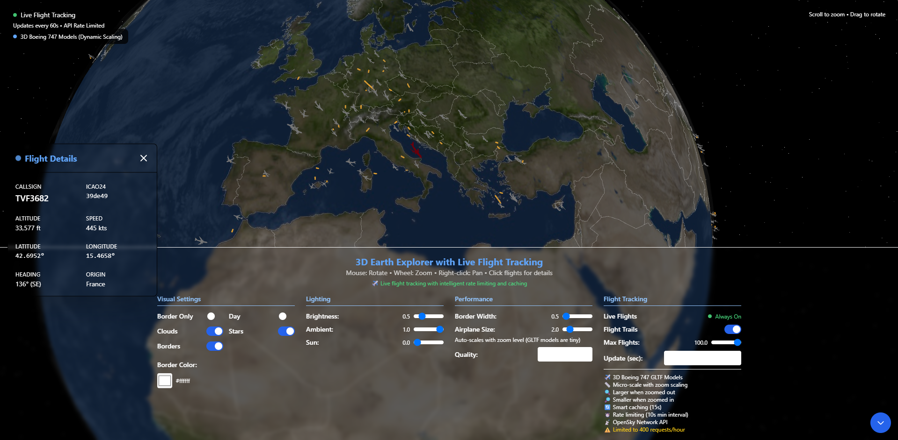

# 3D Earth Explorer with Live Flight Tracking

A real-time 3D flight tracking application built with React, Three.js, and TypeScript that visualizes live aircraft positions on an interactive 3D Earth globe.



## ✨ Features

### 🌍 3D Earth Visualization

-   **Interactive 3D Globe**: Fully rotatable and zoomable Earth with realistic textures
-   **Day/Night Modes**: Switch between day and night Earth textures
-   **Dynamic Lighting**: Adjustable ambient and directional lighting
-   **Cloud Layer**: Optional realistic cloud coverage
-   **Country Borders**: Customizable country boundary lines with color picker
-   **Border-Only Mode**: Clean visualization with just country outlines on gray sphere
-   **Starfield Background**: Immersive space environment

### ✈️ Live Flight Tracking

-   **Real-Time Data**: Live flight positions from OpenSky Network API
-   **3D Boeing 747 Models**: Detailed GLTF airplane models with fallback geometry
-   **Dynamic Scaling**: Airplanes automatically scale based on zoom level
-   **Flight Direction**: Aircraft models rotate to match actual flight headings
-   **Flight Trails**: Real-time flight path visualization with gradient colors
-   **Flight Details**: Comprehensive flight information panel with:
    -   Callsign and ICAO24 identifier
    -   Current position (lat/lng)
    -   Altitude and speed
    -   Heading direction
    -   Origin country
    -   Vertical rate (climb/descent)
    -   Last update timestamp

### 🔧 Advanced Controls

-   **Rate Limiting**: Intelligent API request throttling (400 requests/hour limit)
-   **Smart Caching**: 15-second data caching to reduce API calls
-   **Performance Optimization**: Adjustable Earth quality and airplane count
-   **Zoom Controls**: Enhanced zoom capability (2.5x to 50x distance)
-   **Color Customization**: Country border color picker
-   **Update Intervals**: Configurable refresh rates (30s to 5min)

## 🚀 Technology Stack

-   **Frontend**: React 18 + TypeScript
-   **3D Graphics**: Three.js + React Three Fiber
-   **3D Components**: React Three Drei
-   **Styling**: Tailwind CSS
-   **Build Tool**: Vite
-   **API**: OpenSky Network REST API
-   **3D Models**: GLTF format Boeing 747

## 📦 Installation

1. **Clone the repository**

    ```bash
    git clone <repository-url>
    cd geo-plane-tracker
    ```

2. **Install dependencies**

    ```bash
    npm install
    ```

3. **Start development server**

    ```bash
    npm run dev
    ```

4. **Build for production**
    ```bash
    npm run build
    ```

## 🎮 Usage

### Basic Controls

-   **Mouse Drag**: Rotate the Earth
-   **Mouse Wheel**: Zoom in/out
-   **Right Click + Drag**: Pan the view
-   **Click Airplane**: View detailed flight information

### Flight Tracking

1. Flight tracking is **always enabled** by default
2. Click any airplane to see detailed information in the left panel
3. Enable "Flight Trails" to see real-time flight paths
4. Adjust "Max Flights" to control the number of displayed aircraft
5. Modify "Update Interval" to balance data freshness vs API usage

### Customization

-   **Visual Settings**: Toggle day/night, clouds, stars, borders
-   **Border Colors**: Use the color picker to customize country borders
-   **Airplane Size**: Adjust airplane scaling (auto-scales with zoom)
-   **Performance**: Modify Earth quality and rendering settings

## 📁 Project Structure

```
src/
├── components/
│   ├── Earth/
│   │   └── Earth.tsx              # 3D Earth component
│   ├── Scene/
│   │   └── Scene.tsx              # Main 3D scene setup
│   ├── FlightTracker/
│   │   ├── FlightTracker.tsx      # Flight data management
│   │   ├── Airplane.tsx           # 3D airplane models
│   │   ├── FlightPath.tsx         # Flight trail visualization
│   │   └── FlightDetails.tsx      # Flight information panel
│   └── CountryBorders/
│       └── CountryBorders.tsx     # Country boundary lines
├── utils/
│   ├── flightData.ts              # API service with rate limiting
│   └── scaleUtils.ts              # 3D scaling utilities
├── pages/
│   └── EarthView.tsx              # Main application page
└── public/
    ├── textures/                  # Earth texture files
    ├── model_plane/               # 3D airplane models
    └── ne_10m_admin_0_countries.json # Country border data
```

## 🌐 API Information

### OpenSky Network API

-   **Base URL**: `https://opensky-network.org/api`
-   **Rate Limits**: 400 requests per hour (anonymous)
-   **Data**: Real-time aircraft positions worldwide
-   **Caching**: 15-second local cache to reduce API calls

### Required Assets

1. **Earth Textures** (place in `/public/textures/`):

    - `2k_earth_daymap.jpg` - Day texture
    - `2k_earth_nightmap.jpg` - Night texture
    - `2k_earth_clouds.jpg` - Cloud layer

2. **3D Models** (place in `/public/model_plane/`):

    - `scene.gltf` - Boeing 747 model
    - `scene.bin` - Model binary data

3. **Geographic Data** (place in `/public/`):
    - `ne_10m_admin_0_countries.json` - Country boundaries

## ⚡ Performance Features

-   **Dynamic LOD**: Airplane models scale with distance
-   **Smart Caching**: Reduces redundant API calls
-   **Rate Limiting**: Prevents API quota exhaustion
-   **Optimized Rendering**: Configurable quality settings
-   **Memory Management**: Efficient 3D object handling

## 🔧 Configuration

### Environment Variables

No environment variables required - the app uses public APIs.

### Customization Options

-   Modify `ScaleUtils.ts` for different scaling behavior
-   Adjust `FlightDataService` for different update intervals
-   Customize airplane models by replacing GLTF files
-   Change Earth textures for different visual styles

## 🐛 Troubleshooting

### Common Issues

1. **"Too many requests" error**

    - Increase update intervals (60s+ recommended)
    - The app automatically handles rate limiting with caching

2. **Airplanes too large/small**

    - Adjust the "Airplane Size" slider
    - Check `ScaleUtils.DEFAULT_AIRPLANE_SCALE` value

3. **Missing textures/models**

    - Ensure all required assets are in `/public/` folder
    - Check browser console for 404 errors

4. **Performance issues**
    - Reduce Earth quality setting
    - Lower maximum flight count
    - Disable flight trails if not needed

## 📄 License

This project uses various open-source resources:

-   Boeing 747 3D model: CC-BY-4.0 license from Sketchfab
-   Earth textures: Various sources (check individual files)
-   OpenSky Network: Free API for non-commercial use

## 🤝 Contributing

1. Fork the repository
2. Create a feature branch
3. Make your changes
4. Test thoroughly
5. Submit a pull request

## 📞 Support

For issues or questions:

1. Check the troubleshooting section
2. Review browser console for errors
3. Ensure all required assets are properly placed
4. Verify API connectivity to OpenSky Network

---

Built with ❤️ using React, Three.js, and real-time aviation data.
